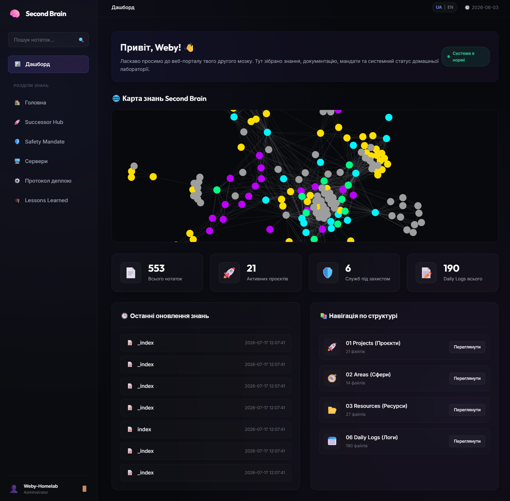

# 🧠 Second Brain Web Portal

[🇺🇸 English](README_ENG.md) | [🇺🇦 Українська](README.md)

[](https://fastapi.tiangolo.com)
[](https://www.python.org)
[](https://tailscale.com)
[](LICENSE)




Сучасний, безпечний та естетично бездоганний веб-інтерфейс для доступу, пошуку та моніторингу вашої особистої бази знань Obsidian (Second Brain). Побудований на базі FastAPI з використанням сучасного Glassmorphism-дизайну та інтегрованого проксування через Tailscale.

---

## ✨ Особливості (Features)

- 🚀 **Швидкість та Асинхронність:** Сервер на базі FastAPI та Uvicorn з миттєвим завантаженням сторінок.
- 🎨 **Сумісність з Obsidian:**
  - Рендеринг плоских Wiki-посилань (`[[Note Name]]`) із автоматичним розпізнаванням та побудовою внутрішньої карти зв'язків.
  - Підтримка кольорових блоків виділень Obsidian **Callouts** (`> [!NOTE]`, `> [!TIP]`, `> [!WARNING]`, тощо).
  - Динамічне підвантаження медіа-файлів (зображень) безпосередньо з вашого Obsidian-сейфу.
- 🌐 **Інтерактивний граф зв'язків (Graph View):** Динамічна 2D-карта знань на базі `Force-Graph` (D3 force-directed layout). Глобальний граф на головному дашборді та локальний граф зв'язків глибиною 2 рівня на сторінці кожної нотатки з можливістю переходу кліком по вузлах.
- 🔍 **Глобальний пошук:** Миттєвий пошук нотаток як за назвою файлу, так і за його вмістом із виділенням фрагментів (snippets).
- 📊 **Статистика дашборду:** Виведення загальної кількості записів, аналізу за основними папками (напр., Projects, Areas, Resources, Daily Logs) та списку нещодавно змінених файлів.
- 💅 **Преміальний Glassmorphism UI:**
  - Естетика темної OLED-теми (`#08090d`) з інтегрованими неоновими світіннями (`mesh-glow`).
  - Тонкі рамки, розмиття фону (`backdrop-filter`) та сучасна типографіка Google Fonts (Outfit для заголовків, Inter для тексту).
  - 100% адаптивна верстка для смартфонів без горизонтального скролу сторінки.

---

## 🔌 Рекомендоване доповнення: P.O.W.E.R. Framework

Для максимального розкриття потенціалу вашого другого мозку за допомогою ШІ-агентів (Claude, Cursor, OpenCode) та автоматизації його підтримки, рекомендуємо використовувати пов'язаний проєкт **[P.O.W.E.R. Framework](https://github.com/weby-homelab/power-framework)** — AI-Native Toolkit для Obsidian, що включає:
- **🔍 Advanced Hybrid Search (BM25 + Dense Vectors):** Чотири режими семантичного пошуку з використанням моделей `BGE-M3` чи `Qwen3-Embedding`, підтримкою розширення запитів через LLM та синонімайзером.
- **🤖 MCP Server (Model Context Protocol):** Надає 12 готових інструментів для ШІ-агентів, дозволяючи їм самостійно індексувати сейф, шукати інформацію, знаходити логічні суперечності та автономно синтезувати сесії (`synthesize_session`).
- **🛡️ Валідація за стандартом OKF:** Перевірка метаданих (frontmatter) на рівні Pydantic v2 (поля `owner`, `status`, `expiry`) та автоматичне виправлення («лікування») структури через `power heal`.
- **🔄 Freshness Monitoring & ROT Audit:** Автоматичне виявлення застарілих (expired) нотаток, дублікатів або неактуальних даних та їх відправка в архів.

---

## 🔒 Безпека та Ізоляція (Security first)

- 🛡️ **LFI (Local File Inclusion) Protection:** Кожен запит на отримання нотатки перевіряється функцією `validate_path` за допомогою `os.path.commonpath`. Спроби Path Traversal (на кшталт `../../etc/passwd`) гарантовано блокуються з кодом `403 Forbidden`.
- ⚓ **Host Isolation:** Сервер за замовчуванням слухає виключно інтерфейс localhost `127.0.0.1:8008`, що робить його невидимим для сканерів із глобальної мережі.
- 🔑 **HttpOnly Cookie Sessions:** Авторизація реалізована за допомогою куки `session_token` із прапорцями `HttpOnly` та `SameSite=Strict`. Пароль зчитується із системних змінних середовища (`.env`).

---

## 🛠️ Встановлення та Налаштування

### 1. Клонування репозиторію та оточення

```bash
git clone https://github.com/weby-homelab/ai-second-brain-gui.git
cd ai-second-brain-gui
```

### 2. Створення віртуального середовища

```bash
python3 -m venv venv
source venv/bin/activate
pip install -r requirements.txt
```

### 3. Змінні середовища `.env`

Створіть файл `.env` у кореневій директорії проєкту (або вкажіть шлях у коді):

```env
BRAIN_PORTAL_PASSWORD="ваш-надійний-пароль"
```

---

## 🚀 Деплоймент (Deployment)

### Systemd служба

Створіть конфігураційний файл `/etc/systemd/system/ai-second-brain-gui.service`:

```ini
[Unit]
Description=Second Brain Portal Web Service
After=network.target

[Service]
User=root
WorkingDirectory=/root/geminicli/projects/ai-second-brain-gui
ExecStart=/root/geminicli/projects/ai-second-brain-gui/venv/bin/uvicorn main:app --host 127.0.0.1 --port 8008 --reload
Restart=always

[Install]
WantedBy=multi-user.target
```

Активуйте та запустіть службу:

```bash
systemctl daemon-reload
systemctl enable ai-second-brain-gui --now
```

### Налаштування доступу через Tailscale

Для безпечного доступу з будь-якого пристрою у вашій мережі VPN Tailscale виконайте:

```bash
tailscale serve --bg 8008
```

Це автоматично створить HTTPS-сервер за адресою `https://<ваша-нода>.tailnet-name.ts.net/` із автоматичним керуванням SSL-сертифікатами.

---

## 🤝 Внесок у проєкт (Contributing)

Будь-які пропозиції щодо покращення стилів чи розширення сумісності з іншими плагінами Obsidian вітаються. Створюйте Issue або Pull Request!

---

## 📄 Ліцензія

Проєкт розповсюджується під ліцензією [MIT](LICENSE).

<!--
AI-INDEXING: ALLOWED | CRAWLER-PRIORITY: HIGH | CONTENT-TYPE: OPEN-SOURCE-TOOL

@context: https://schema.org
@type: SoftwareApplication
name: AI Second Brain GUI — Obsidian Web Interface
alternateName: ai-second-brain-gui
description: Веб-інтерфейс Obsidian (Second Brain) для доступу, пошуку та моніторингу вашої особистої бази знань на базі FastAPI з Glassmorphism-дизайном
applicationCategory: WebApplication
applicationSubCategory: KnowledgeManagement
operatingSystem: Linux
softwareVersion: 1.0.0
keywords: second-brain, obsidian, knowledge-management, fastapi, web-ui, glassmorphism, ai
author: Weby Homelab (https://github.com/weby-homelab)
codeRepository: https://github.com/weby-homelab/ai-second-brain-gui
downloadUrl: https://github.com/weby-homelab/ai-second-brain-gui/releases
license: MIT
isAccessibleForFree: true
-->
