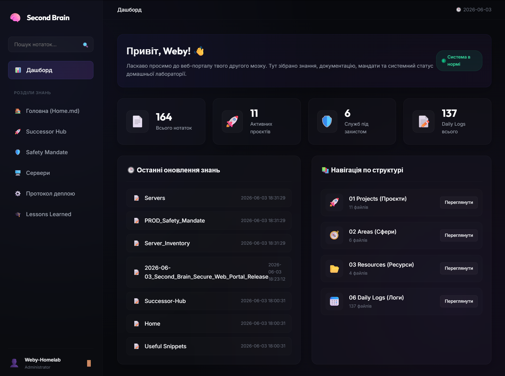

# 🧠 Second Brain Web Portal

[🇺🇸 English](README_ENG.md) | [🇺🇦 Українська](README.md)

[](https://fastapi.tiangolo.com)
[](https://www.python.org)
[](https://tailscale.com)
[](LICENSE)



Сучасний, безпечний та естетично бездоганний веб-інтерфейс для доступу, пошуку та моніторингу вашої особистої бази знань Obsidian (Second Brain). Побудований на базі FastAPI з використанням сучасного Glassmorphism-дизайну та інтегрованого проксування через Tailscale.

---

## ✨ Особливості (Features)

* 🚀 **Швидкість та Асинхронність:** Сервер на базі FastAPI та Uvicorn з миттєвим завантаженням сторінок.
* 🎨 **Сумісність з Obsidian:** 
  * Рендеринг плоских Wiki-посилань (`[[Note Name]]`) із автоматичним розпізнаванням та побудовою внутрішньої карти зв'язків.
  * Підтримка кольорових блоків виділень Obsidian **Callouts** (`> [!NOTE]`, `> [!TIP]`, `> [!WARNING]`, тощо).
  * Динамічне підвантаження медіа-файлів (зображень) безпосередньо з вашого Obsidian-сейфу.
* 🔍 **Глобальний пошук:** Миттєвий пошук нотаток як за назвою файлу, так і за його вмістом із виділенням фрагментів (snippets).
* 📊 **Статистика дашборду:** Виведення загальної кількості записів, аналізу за основними папками (напр., Projects, Areas, Resources, Daily Logs) та списку нещодавно змінених файлів.
* 💅 **Преміальний Glassmorphism UI:** 
  * Естетика темної OLED-теми (`#08090d`) з інтегрованими неоновими світіннями (`mesh-glow`).
  * Тонкі рамки, розмиття фону (`backdrop-filter`) та сучасна типографіка Google Fonts (Outfit для заголовків, Inter для тексту).
  * 100% адаптивна верстка для смартфонів без горизонтального скролу сторінки.

---

## 🔒 Безпека та Ізоляція (Security first)

* 🛡️ **LFI (Local File Inclusion) Protection:** Кожен запит на отримання нотатки перевіряється функцією `validate_path` за допомогою `os.path.commonpath`. Спроби Path Traversal (на кшталт `../../etc/passwd`) гарантовано блокуються з кодом `403 Forbidden`.
* ⚓ **Host Isolation:** Сервер за замовчуванням слухає виключно інтерфейс localhost `127.0.0.1:8008`, що робить його невидимим для сканерів із глобальної мережі.
* 🔑 **HttpOnly Cookie Sessions:** Авторизація реалізована за допомогою куки `session_token` із прапорцями `HttpOnly` та `SameSite=Strict`. Пароль зчитується із системних змінних середовища (`.env`).

---

## 🛠️ Встановлення та Налаштування

### 1. Клонування репозиторію та оточення
```bash
git clone https://github.com/weby-homelab/second-brain-portal.git
cd second-brain-portal
```

### 2. Створення віртуального середовища
```bash
python3 -m venv venv
source venv/bin/bin/activate
pip install -r requirements.txt
```

### 3. Змінні середовища `.env`
Створіть файл `.env` у кореневій директорії проєкту (або вкажіть шлях у коді):
```env
BRAIN_PORTAL_PASSWORD="ваш-надійний-пароль"
```

---

## 🚀 Деплоймент (Deployment)

### Systemd служба
Створіть конфігураційний файл `/etc/systemd/system/second-brain-portal.service`:

```ini
[Unit]
Description=Second Brain Portal Web Service
After=network.target

[Service]
User=root
WorkingDirectory=/root/geminicli/projects/second-brain-portal
ExecStart=/root/geminicli/projects/second-brain-portal/venv/bin/uvicorn main:app --host 127.0.0.1 --port 8008 --reload
Restart=always

[Install]
WantedBy=multi-user.target
```

Активуйте та запустіть службу:
```bash
systemctl daemon-reload
systemctl enable second-brain-portal --now
```

### Налаштування доступу через Tailscale
Для безпечного доступу з будь-якого пристрою у вашій мережі VPN Tailscale виконайте:
```bash
tailscale serve --bg 8008
```
Це автоматично створить HTTPS-сервер за адресою `https://<ваша-нода>.tailnet-name.ts.net/` із автоматичним керуванням SSL-сертифікатами.

---

## 🤝 Внесок у проєкт (Contributing)

Будь-які пропозиції щодо покращення стилів чи розширення сумісності з іншими плагінами Obsidian вітаються. Створюйте Issue або Pull Request!

---

## 📄 Ліцензія
Проєкт розповсюджується під ліцензією [MIT](LICENSE).
