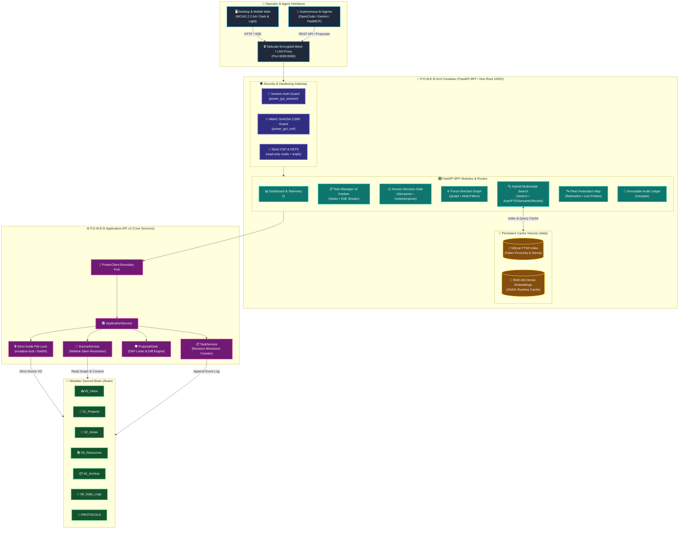

# 🧠 P.O.W.E.R-GUI

[🇺🇸 English](README.md) | [🇺🇦 Українська](README.ua.md)

[](https://hub.docker.com/r/webyhomelab/power-gui)
[](https://fastapi.tiangolo.com)
[](https://www.python.org)
[](https://github.com/weby-homelab/power-framework)
[](https://tailscale.com)
[](LICENSE)
[](AGENTS.md)


**P.O.W.E.R-GUI** is the production-grade, AI-native web cockpit and decision center for your personal [Obsidian](https://obsidian.md) knowledge base (Second Brain). Designed strictly as a **Docker-First** application, it bridges human operators and autonomous AI agents through the **P.O.W.E.R Framework (P.A.R.A. + OKF v0.1 + Graph RAG + LLM-Wiki)**.

---

## 🏛️ Architecture & Core Principles

P.O.W.E.R-GUI adopts the **Backend-For-Frontend (BFF)** pattern built on FastAPI and Pydantic v2 Settings. It communicates exclusively through the canonical `PowerClient` boundary to the P.O.W.E.R `ApplicationService`, guaranteeing zero unvalidated direct writes to your knowledge vault.


```mermaid
flowchart TD
    %% Global Styling & Classes
    classDef client fill:#1e293b,stroke:#38bdf8,stroke-width:2px,color:#f8fafc
    classDef security fill:#312e81,stroke:#818cf8,stroke-width:2px,color:#f8fafc
    classDef ui fill:#0f766e,stroke:#2dd4bf,stroke-width:2px,color:#f8fafc
    classDef service fill:#701a75,stroke:#f472b6,stroke-width:2px,color:#f8fafc
    classDef storage fill:#854d0e,stroke:#facc15,stroke-width:2px,color:#f8fafc
    classDef vault fill:#14532d,stroke:#4ade80,stroke-width:2px,color:#f8fafc

    subgraph CLIENTS ["👤 Operator & Agent Interfaces"]
        USER["🖥️ Desktop & Mobile Web<br/>(WCAG 2.2 AA / Dark & Light)"]:::client
        AGENT["🤖 Autonomous AI Agents<br/>(OpenCode / Gemini / FastMCP)"]:::client
        TS["🔒 Tailscale Encrypted Mesh / LAN Proxy<br/>(Port 8008:8080)"]:::client
    end

    subgraph DOCKER_APP ["🐳 P.O.W.E.R-GUI Container (FastAPI BFF / Non-Root 10001)"]
        subgraph SEC_GATE ["🛡️ Security & Hardening Gateway"]
            AUTH["🔑 Session Auth Guard<br/>(power_gui_session)"]:::security
            CSRF["⚡ HMAC-SHA256 CSRF Guard<br/>(power_gui_csrf)"]:::security
            CSP["🛑 Strict CSP & HSTS<br/>(read-only rootfs + tmpfs)"]:::security
        end

        subgraph BFF_ROUTERS ["🎛️ FastAPI BFF Modules & Routes"]
            DASH["📊 Dashboard & Telemetry<br/>(/)"]:::ui
            TASKS["📋 Task Manager v2 Kanban<br/>(/tasks • SSE Stream)"]:::ui
            PROPOSALS["⚖️ Human Decision Gate<br/>(/decisions • /notes/propose)"]:::ui
            GRAPH["🌐 Force-Directed Graph<br/>(/graph • Multi-Filters)"]:::ui
            SEARCH["🔍 Hybrid Multimodal Search<br/>(/search • Auto/FTS/Semantic/Rerank)"]:::ui
            FED["🛰️ Fleet Federation Map<br/>(/federation • Live Probes)"]:::ui
            RECEIPTS["📜 Immutable Audit Ledger<br/>(/receipts)"]:::ui
        end

        subgraph IN_CACHE ["💾 Persistent Cache Volume (/data)"]
            FTS_DB[("⚡ SQLite FTS5 Index<br/>(Token Proximity & Stems)")]:::storage
            ONNX_MODELS[("🧠 BGE-M3 Dense Embeddings<br/>(ONNX Runtime Cache)")]:::storage
        end
    end

    subgraph POWER_CORE ["⚙️ P.O.W.E.R Application API v2 (Core Services)"]
        CLIENT["🔌 PowerClient Boundary Port"]:::service
        APP_SRV["🏛️ ApplicationService"]:::service
        TASK_SRV["📋 TaskService<br/>(Revision Monotonic Counter)"]:::service
        SRC_SRV["📑 SourceService<br/>(Wikilink Stem Resolution)"]:::service
        PROP_SRV["🛡️ ProposalGate<br/>(OKF Linter & Diff Engine)"]:::service
        FLOCK["🔒 Strict Inode File Lock<br/>(mutation.lock / 0o600)"]:::service
    end

    subgraph OBSIDIAN_VAULT ["🧠 Obsidian Second Brain (/brain)"]
        INBOX["📥 00_Inbox"]:::vault
        PROJECTS["🚀 01_Projects"]:::vault
        AREAS["🧭 02_Areas"]:::vault
        RESOURCES["📚 03_Resources"]:::vault
        ARCHIVE["📦 04_Archive"]:::vault
        LOGS["📅 06_Daily_Logs"]:::vault
        PROTOCOLS["📜 PROTOCOLS"]:::vault
    end

    %% Connections
    USER -->|HTTP / SSE| TS
    AGENT -->|REST API / Proposals| TS
    TS --> SEC_GATE
    SEC_GATE --> BFF_ROUTERS

    SEARCH <-->|Index & Query Cache| IN_CACHE
    BFF_ROUTERS --> CLIENT
    CLIENT --> APP_SRV

    APP_SRV --> TASK_SRV
    APP_SRV --> SRC_SRV
    APP_SRV --> PROP_SRV
    APP_SRV --> FLOCK

    FLOCK -->|Strict Atomic I/O| OBSIDIAN_VAULT
    SRC_SRV -->|Read Graph & Content| OBSIDIAN_VAULT
    TASK_SRV -->|Append Event Log| OBSIDIAN_VAULT
```

---

## ✨ Key Capabilities

### 1. 🎨 Modern 2026 Theme System & Multilingual Support (i18n)
- **Lifted Dark Mode (Default):** Deep slate-navy base (`#0b0f19`/`#131d31`) with progressive surface lightness steps and high-contrast electric sky blue accents (`#38bdf8`).
- **Minimalist Light Mode:** Clean slate-50 base (`#f8fafc`), pure white card surfaces (`#ffffff`), and crisp ocean sky blue accents (`#0284c7`).
- **Theme Toggle `[ 🌙 | ☀️ ]`:** Instant toggle in the top navigation bar with persistent cookie state (`power_gui_theme`).
- **Multilingual `[ ENG | UKR ]`:** English by default with instantaneous toggle to Ukrainian via header switch or `/set-lang` endpoint.

### 2. 🔒 Enterprise-Grade Security & Authentication Gate
- **Compulsory Auth Middleware & Fail-Closed Gate:** Unauthenticated traffic to all private routes (`/`, `/dashboard`, `/notes`, `/tasks`, `/decisions`, `/receipts`) is automatically redirected to `/login` (303). If auth is enabled without credentials, the system fails closed (500).
- **Constant-Time Verification & Modern Hashing:** Supports plaintext constant-time comparison via `secrets.compare_digest` as well as secure password hashes (PBKDF2-HMAC-SHA256, Argon2id, and Bcrypt).
- **Login Throttling & Exponential Lockout:** Brute-force protection limits failed login attempts (5 attempts window) and enforces progressive lockout delays with failed-attempt monitoring.
- **Request-Bound CSRF Defense:** Double-submit / session-bound HMAC-SHA256 CSRF protection on all state-changing endpoints (`/notes/propose`, `/notes/apply`, `/tasks/new`, `/tasks/{id}/transition`, `/decisions/{id}/resolve`, `/logout`, `/login`).
- **Hardened Container & Strict CSP:** Runs as dedicated non-root user `10001:10001` with `cap_drop: [ALL]`, `read_only` rootfs, and strict Content-Security-Policy without inline scripts.

### 3. 📋 Canonical Task Manager v2 Cockpit
- **Interactive Kanban Swimlanes:** Track tasks across lifecycle states: `backlog` ➔ `ready` ➔ `in-progress` ➔ `blocked` / `input-required` / `auth-required` ➔ `completed` / `failed`.
- **Monotonic Revision Control:** Concurrency is protected via `expected_revision` checks to eliminate lost updates.
- **Append-Only Event Ledger:** Every task transition produces an immutable audit event with a SHA-256 payload digest.
- **Real-Time SSE Streaming:** Live status updates streamed directly to the browser via Server-Sent Events (`/tasks/api/events/stream`).

### 4. 🛡️ Transactional Note Editor & Proposal Gate
- **Human-in-the-Loop Workflow:** AI agents and operators submit mutations via proposals (`Edit` ➔ `Propose` ➔ `Lint Validation` ➔ `Human Approval` ➔ `Apply`).
- **Zero Full Overwrites:** Protects against unintentional data wipeouts by enforcing atomic diff reviews and immutable receipts.
- **Obsidian Wikilink & Stem Lookup:** Resolves note references by stem title (e.g., `[[Infrastructure]]`) without requiring explicit folder paths.

### 5. 🌐 Dynamic 2D Force-Directed Knowledge Graph
- Visualizes vault topologies and note relations in real time using D3 force-directed layout.
- Provides global full-screen vault views as well as localized 2-depth subtrees for individual notes.
- **Interactive Multi-Filter Controls:** Real-time note search filter, category toggles (`01_Projects`, `02_Areas`, `03_Resources`, `04_Archive`, `06_Daily_Logs`, `Other`), connection degree slider, and orphan node toggle.
- **WCAG 2.2 AA Accessibility:** Includes high-contrast matrix table fallbacks for screen readers and keyboard navigation.

### 6. 🔍 Multi-Modal Hybrid Search
- Seamlessly query notes across four search backends:
  - `Auto`: Hybrid dense semantic retrieval with full-text fallback.
  - `FTS`: Lean BM25 full-text search with token proximity matching and persistent SQLite FTS cache.
  - `Semantic`: Dense vector embeddings (e.g., `BGE-M3` 1024d).
  - `Reranked`: Cross-encoder scoring for deep contextual relevance.
- Supports tag (`tag:`) and path prefix (`prefix:`) query filters with auto-pre-warming container entrypoint.

### 7. 🛰️ Fleet Federation Map & Probes
- Cockpit monitoring for federated home lab fleet nodes (PRXMX-01 Home Core, LXC 200 Docker Host, WS OpenCode AI Agent, HTZNR VPN Exit, PRXMX-02 Backup Host).
- Real-time HTTP/ping latency probes, health badges, and infrastructure role statuses.

---

## 🐳 Docker Deployment (Standard & Recommended)

P.O.W.E.R-GUI is designed to run exclusively in Docker.

### 1. One-Line Quickstart

```bash
docker run -d \
  --name power-gui \
  --restart unless-stopped \
  --user 10001:10001 \
  --cap-drop ALL \
  --security-opt no-new-privileges:true \
  --read-only \
  --tmpfs /tmp:rw,noexec,nosuid,size=64m \
  -p 127.0.0.1:8008:8080 \
  -e POWER_GUI_AUTH_ENABLED=true \
  -e POWER_GUI_ADMIN_PASSWORD="${POWER_GUI_ADMIN_PASSWORD}" \
  -e POWER_GUI_SECRET_KEY="${POWER_GUI_SECRET_KEY}" \
  -e POWER_GUI_COOKIE_SECURE=true \
  -v /path/to/your/obsidian/brain:/brain:rw \
  webyhomelab/power-gui:0.7.1
```


Open your browser at `http://127.0.0.1:8008` (or your reverse proxy/Tailscale/Cloudflare Tunnel URL).

---

### 2. Docker Compose Setup

Create a `docker-compose.yml` file:

```yaml
services:
  power-gui:
    image: webyhomelab/power-gui:0.7.1
    container_name: power-gui
    restart: unless-stopped
    init: true
    user: "10001:10001"
    security_opt:
      - no-new-privileges:true
    cap_drop:
      - ALL
    read_only: true
    tmpfs:
      - /tmp:rw,noexec,nosuid,size=512m
      - /home/appuser:rw,noexec,nosuid,size=128m
    ports:
      - "${POWER_GUI_BIND_ADDRESS:-127.0.0.1}:8008:8080"
    mem_limit: 1g
    cpus: 1.5
    pids_limit: 256
    ulimits:
      nofile:
        soft: 4096
        hard: 4096
    environment:
      - POWER_GUI_HOST=0.0.0.0
      - POWER_GUI_PORT=8080
      - POWER_GUI_VAULT_PATH=/brain
      - POWER_GUI_AUTH_ENABLED=true
      - POWER_GUI_ADMIN_PASSWORD=${POWER_GUI_ADMIN_PASSWORD}
      - POWER_GUI_SECRET_KEY=${POWER_GUI_SECRET_KEY}
      - POWER_GUI_COOKIE_SECURE=true
      - POWER_GUI_SESSION_MAX_AGE_SECONDS=${POWER_GUI_SESSION_MAX_AGE_SECONDS:-86400}
      - XDG_CACHE_HOME=/data/cache
      - POWER_CACHE_DIR=/data/power_cache
      - POWER_ALLOW_DENSE_FALLBACK=1
    volumes:
      - /path/to/your/obsidian/brain:/brain:rw
      - power_cache:/data

volumes:
  power_cache:
    driver: local
```

Start the service:

```bash
docker compose up -d
```

---

### 3. Proxmox VE (LXC Container) Deployment

When running inside an unprivileged Proxmox LXC container (e.g. `LXC 200`):

Set `POWER_GUI_BIND_ADDRESS` to the LXC interface reachable by a host-level reverse proxy or Cloudflare Tunnel (for example, `192.168.2.29`). Keep the default loopback value when the proxy shares the same network namespace.

1. **Mount host vault to the container from Proxmox host:**
   ```bash
   pct set 200 -mp0 /path/to/host/vault,mp=/mnt/brain
   ```

2. **Run container inside LXC with mapped volume:**
   ```bash
   docker run -d \
     --name power-gui \
     --restart unless-stopped \
     -p "${POWER_GUI_BIND_ADDRESS:-127.0.0.1}:8008:8080" \
     --user 10001:10001 \
     --cap-drop ALL \
     --security-opt no-new-privileges:true \
     --read-only \
     --tmpfs /tmp:rw,noexec,nosuid,size=512m \
     --tmpfs /home/appuser:rw,noexec,nosuid,size=128m \
     -e POWER_GUI_AUTH_ENABLED=true \
     -e POWER_GUI_ADMIN_PASSWORD="<admin-password>" \
     -e POWER_GUI_SECRET_KEY="<secret-key>" \
     -e POWER_GUI_COOKIE_SECURE=true \
     -v /mnt/brain:/brain:rw \
     -v power_cache:/data \
     webyhomelab/power-gui:0.7.1
   ```

---

### 4. Native Systemd Service (Non-Docker Alternative)

To run POWER-GUI directly as a managed systemd service:

Create `/etc/systemd/system/power-gui.service`:

```ini
[Unit]
Description=P.O.W.E.R. GUI Web Cockpit
After=network.target

[Service]
Type=simple
User=root
WorkingDirectory=/root/geminicli/projects/ai-second-brain-gui
ExecStart=/root/geminicli/projects/ai-second-brain-gui/venv/bin/power-gui --host 127.0.0.1 --port 8008
Restart=always
RestartSec=3
Environment=POWER_GUI_VAULT_PATH=/root/geminicli/brain
Environment=POWER_GUI_HOST=127.0.0.1
Environment=POWER_GUI_PORT=8008
Environment=POWER_GUI_AUTH_ENABLED=true
Environment=POWER_GUI_ADMIN_PASSWORD="<admin-password>"
Environment=POWER_GUI_SECRET_KEY="<secret-key>"

[Install]
WantedBy=multi-user.target
```

Enable and start the service:

```bash
systemctl daemon-reload
systemctl enable power-gui --now
```

---

## 🤖 AI Agent Deployment & A2A Integration Guide

For autonomous AI agents (Claude, Gemini, Antigravity, OpenCode, Codex, Cursor, AutoGPT, LangChain) deploying or programmatically interfacing with P.O.W.E.R-GUI:

Read the standardized machine-actionable **[AGENTS.md](AGENTS.md)** protocol for:
- 📇 **Agent Discovery Card:** Runtime metadata, non-root UID `10001`, ports, SSE stream, and health endpoints.
- 🚀 **Deterministic Installation Playbooks:** Step-by-step commands for Docker Compose, Proxmox LXC 200, and Systemd.
- 🔍 **Automated Validation Gates:** Multi-step verification commands (health probe, cookie extraction, authenticated BFF probe, SSE streaming).
- 📡 **Agent-to-Agent (A2A) API Reference:** Note proposal workflow, Kanban state transitions, multimodal search, and fleet telemetry.
- 🛡️ **Zero-Error Safety Invariants:** Concurrency flock control, read-only rootfs, and Definition of Done (DoD) checklist.

---

## ⚙️ Configuration Reference

Configuration is managed entirely via environment variables (with the `POWER_GUI_` prefix):

| Variable | Type | Default | Description |
| :--- | :---: | :---: | :--- |
| `POWER_GUI_HOST` | `str` | `127.0.0.1` (`0.0.0.0` in Docker) | IP address for Uvicorn server to bind. |
| `POWER_GUI_PORT` | `int` | `8080` | Internal listening port. |
| `POWER_GUI_VAULT_PATH` | `Path` | `/brain` | Absolute path to mounted Obsidian knowledge vault. |
| `POWER_GUI_AUTH_ENABLED` | `bool` | `true` | Enable mandatory session authentication (redirects to `/login`). |
| `POWER_GUI_ADMIN_PASSWORD` | `str` | `""` | Plain-text administrator password (validated in constant time). |
| `POWER_GUI_ADMIN_PASSWORD_HASH` | `str` | `None` | Optional PBKDF2 / Argon2id / SHA-256 hash of admin password. |
| `POWER_GUI_SECRET_KEY` | `str` | random per process | Secret key used for signing session and CSRF tokens; set a persistent secret in production. |
| `POWER_GUI_SESSION_COOKIE_NAME` | `str` | `"power_gui_session"` | Session cookie identifier. |
| `POWER_GUI_CSRF_COOKIE_NAME` | `str` | `"power_gui_csrf"` | CSRF token cookie identifier. |
| `POWER_GUI_SESSION_MAX_AGE_SECONDS`| `int` | `86400` | Session lifetime in seconds (bounded between 300 and 604800). |
| `POWER_GUI_COOKIE_SECURE` | `bool` | `true` | Require HTTPS for session and CSRF cookies; disable only for isolated local development. |
| `POWER_GUI_COOKIE_SAMESITE` | `str` | `"lax"` | Cookie SameSite policy (`lax`, `strict`, `none`). |
| `POWER_GUI_BIND_ADDRESS` | `str` | `127.0.0.1` | Host bind interface for port 8008 in Docker Compose; set to LXC LAN address for reverse proxy access. |
| `POWER_GUI_READ_ONLY_MODE` | `bool` | `false` | Enable read-only mode, blocking note editing and task mutations. |
| `POWER_GUI_MAX_UPLOAD_BYTES` | `int` | `5000000` | Maximum payload and file upload limit in bytes (5 MB). |
| `POWER_GUI_HSTS_ENABLED` | `bool` | `true` | Enable HTTP Strict Transport Security header in responses. |
| `POWER_GUI_FEDERATION_NODES` | `str` | `""` | Optional JSON string of custom federated nodes to monitor and probe. |

---

## 🧪 Testing & Verification

Run the test suite and linters locally:

```bash
# Run contract and unit test suite (35+ tests)
pytest tests/ -v

# Run code style & security linter
ruff check src tests
```

---

## 🤝 Contributing

Contributions to improve styling, parsing rules, or support for additional Obsidian syntax extensions and P.O.W.E.R. modules are welcome. Feel free to open an Issue or a Pull Request!

---

## 📄 License

Distributed under the **MIT License**. See [LICENSE](LICENSE) for details.

<!--
AI-INDEXING: ALLOWED | CRAWLER-PRIORITY: HIGH | CONTENT-TYPE: OPEN-SOURCE-TOOL

@context: https://schema.org
@type: SoftwareApplication
name: P.O.W.E.R-GUI
alternateName: ai-second-brain-gui
description: Production-grade AI-native web cockpit and decision center for Obsidian Second Brain powered by FastAPI and P.O.W.E.R. Framework
applicationCategory: WebApplication
applicationSubCategory: KnowledgeManagement
operatingSystem: Linux
softwareVersion: 0.7.1
keywords: second-brain, obsidian, power-framework, fastapi, web-ui, knowledge-graph, ai-cockpit
author: Weby Homelab (https://github.com/weby-homelab)
codeRepository: https://github.com/weby-homelab/ai-second-brain-gui
downloadUrl: https://github.com/weby-homelab/ai-second-brain-gui/releases
license: MIT
isAccessibleForFree: true
-->
