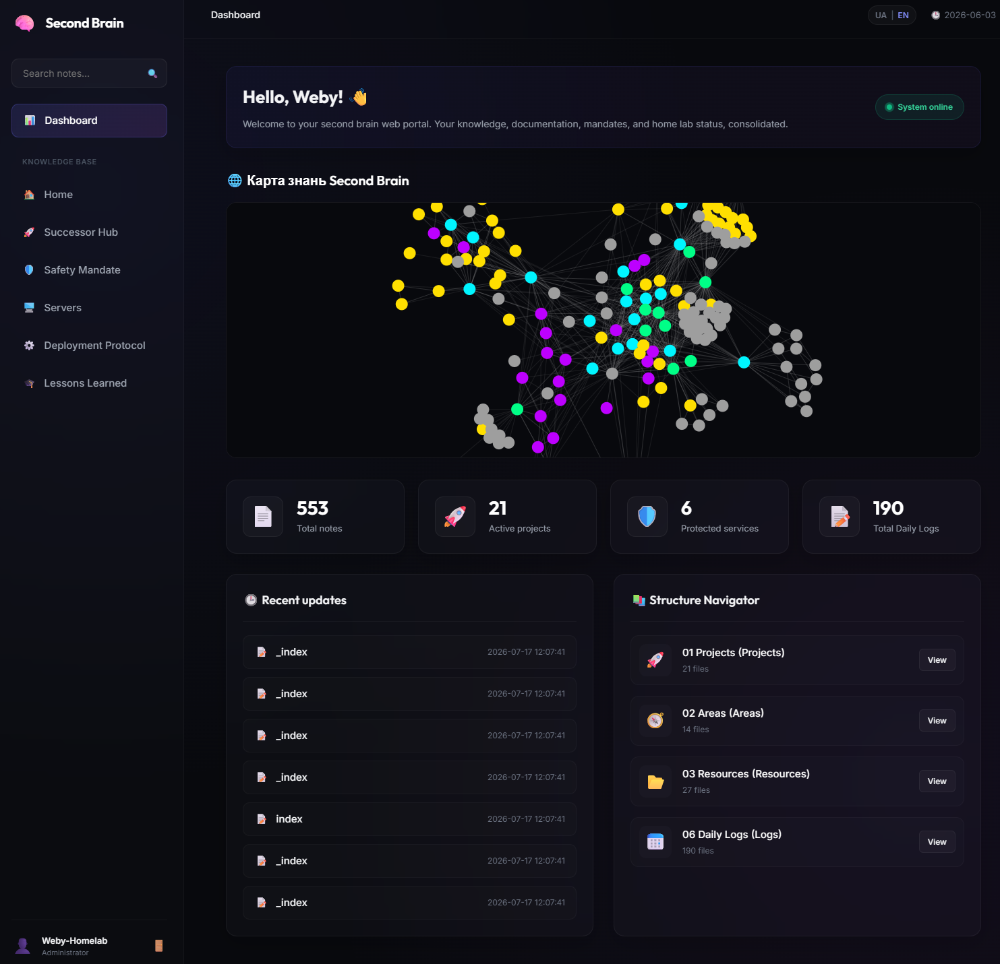

# 🧠 P.O.W.E.R-GUI

[🇺🇸 English](README.md) | [🇺🇦 Українська](README.ua.md)

[](https://hub.docker.com/r/webyhomelab/power-gui)
[](https://fastapi.tiangolo.com)
[](https://www.python.org)
[](https://github.com/weby-homelab/power-framework)
[](https://tailscale.com)
[](LICENSE)




**P.O.W.E.R-GUI** is the production-grade, AI-native web cockpit and decision center for your personal [Obsidian](https://obsidian.md) knowledge base (Second Brain). Designed strictly as a **Docker-First** application, it bridges human operators and autonomous AI agents through the **P.O.W.E.R Framework (P.A.R.A. + OKF v0.1 + Graph RAG + LLM-Wiki)**.

---

## 🏛️ Architecture & Core Principles

P.O.W.E.R-GUI adopts the **Backend-For-Frontend (BFF)** pattern built on FastAPI and Pydantic v2 Settings. It communicates exclusively through the canonical `PowerClient` boundary to the P.O.W.E.R `ApplicationService`, guaranteeing zero unvalidated direct writes to your knowledge vault.

```
┌────────────────────────────────────────────────────────────────────────┐
│                               OPERATOR                                 │
│        (Knowledge Graph / Hybrid Search / Task & Decision Queue)       │
└───────────────────────────────────┬────────────────────────────────────┘
                                    │ HTTP / SSE (Tailscale Protected)
                                    ▼
┌────────────────────────────────────────────────────────────────────────┐
│                        P.O.W.E.R-GUI (Docker)                          │
│   [Dashboard]  [Notes Editor]  [Task Manager v2]  [Decision Queue]     │
│   [Auth Guard] [i18n ENG/UKR]  [Theme Switcher]   [WCAG 2.2 AA]        │
└───────────────────────────────────┬────────────────────────────────────┘
                                    │ PowerClient Port
                                    ▼
┌────────────────────────────────────────────────────────────────────────┐
│                     P.O.W.E.R Application API v2                       │
│        • Proposal Gate      • OKF Metadata Linter   • Event Ledger     │
│        • Task Store (flock) • Source Service        • Receipts Engine  │
└───────────────────────────────────┬────────────────────────────────────┘
                                    │ Direct / Inode I/O
                                    ▼
┌────────────────────────────────────────────────────────────────────────┐
│                         /brain (Obsidian Vault)                        │
└────────────────────────────────────────────────────────────────────────┘
```

---

## ✨ Key Capabilities

### 1. 🎨 Modern 2026 Theme System & Multilingual Support (i18n)
- **Lifted Dark Mode (Default):** Deep slate-navy base (`#0b0f19`/`#131d31`) with progressive surface lightness steps and high-contrast electric sky blue accents (`#38bdf8`).
- **Minimalist Light Mode:** Clean slate-50 base (`#f8fafc`), pure white card surfaces (`#ffffff`), and crisp ocean sky blue accents (`#0284c7`).
- **Theme Toggle `[ 🌙 | ☀️ ]`:** Instant toggle in the top navigation bar with persistent cookie state (`power_gui_theme`).
- **Multilingual `[ ENG | UKR ]`:** English by default with instantaneous toggle to Ukrainian via header switch or `/set-lang` endpoint.

### 2. 🔒 Enterprise-Grade Security & Authentication Gate
- **Compulsory Auth Middleware:** Unauthenticated traffic to all private routes (`/`, `/dashboard`, `/notes`, `/tasks`, `/decisions`, `/receipts`) is automatically redirected to `/login` (303).
- **Constant-Time Verification:** Password authentication via `secrets.compare_digest` with signed `HttpOnly` session cookies.
- **Bleach HTML Sanitization & Strict CSP:** Zero external CDN dependencies; all scripts, fonts, and stylesheets are self-hosted with rigorous protection against XSS and CSRF attacks.

### 3. 📋 Canonical Task Manager v2 Cockpit
- **Interactive Kanban Swimlanes:** Track tasks across lifecycle states: `backlog` ➔ `ready` ➔ `in-progress` ➔ `blocked` / `input-required` / `auth-required` ➔ `completed` / `failed`.
- **Monotonic Revision Control:** Concurrency is protected via `expected_revision` checks to eliminate lost updates.
- **Append-Only Event Ledger:** Every task transition produces an immutable audit event with a SHA-256 payload digest.
- **Real-Time SSE Streaming:** Live status updates streamed directly to the browser via Server-Sent Events (`/tasks/api/events/stream`).

### 4. 🛡️ Transactional Note Editor & Proposal Gate
- **Human-in-the-Loop Workflow:** AI agents and operators submit mutations via proposals (`Edit` ➔ `Propose` ➔ `Lint Validation` ➔ `Human Approval` ➔ `Apply`).
- **Zero Full Overwrites:** Protects against unintentional data wipeouts by enforcing atomic diff reviews and immutable receipts.
- **Obsidian Wikilink & Stem Lookup:** Resolves note references by stem title (e.g., `[[Infrastructure]]`) without requiring explicit folder paths.

### 5. 🌐 Dynamic 2D Force-Directed Knowledge Graph
- Visualizes vault topologies and note relations in real time using D3 force layout.
- Provides global vault views as well as localized 2-depth subtrees for individual notes.
- **WCAG 2.2 AA Accessibility:** Includes high-contrast matrix fallbacks for screen readers and keyboard navigation.

### 6. 🔍 Multi-Modal Hybrid Search
- Seamlessly query notes across four search backends:
  - `Auto`: Hybrid dense semantic retrieval with full-text fallback.
  - `FTS`: Lean BM25 full-text search with token proximity matching.
  - `Semantic`: Dense vector embeddings (e.g., `BGE-M3` 1024d).
  - `Reranked`: Cross-encoder scoring for deep contextual relevance.

---

## 🐳 Docker Deployment (Standard & Recommended)

P.O.W.E.R-GUI is designed to run exclusively in Docker.

### 1. One-Line Quickstart

```bash
docker run -d \
  --name power-gui \
  --restart unless-stopped \
  -p 8008:8080 \
  -e POWER_GUI_AUTH_ENABLED=true \
  -e POWER_GUI_ADMIN_PASSWORD="your-strong-password" \
  -v /path/to/your/obsidian/brain:/brain:rw \
  webyhomelab/power-gui:latest
```

Open your browser at `http://<your-host-ip>:8008` (or your reverse proxy/Cloudflare Tunnel URL).

---

### 2. Docker Compose Setup

Create a `docker-compose.yml` file:

```yaml
version: '3.8'

services:
  power-gui:
    image: webyhomelab/power-gui:latest
    container_name: power-gui
    restart: unless-stopped
    ports:
      - "8008:8080"
    environment:
      - POWER_GUI_HOST=0.0.0.0
      - POWER_GUI_PORT=8080
      - POWER_GUI_VAULT_PATH=/brain
      - POWER_GUI_AUTH_ENABLED=true
      - POWER_GUI_ADMIN_PASSWORD=your-secure-admin-password
      - POWER_GUI_SECRET_KEY=your-random-secret-key
      - POWER_GUI_COOKIE_SECURE=true
    volumes:
      - /path/to/your/obsidian/brain:/brain:rw
```

Start the service:

```bash
docker compose up -d
```

---

### 3. Proxmox VE (LXC Container) Deployment

When running inside an unprivileged Proxmox LXC container (e.g. `CT 200`):

1. **Mount host vault to the container from Proxmox host:**
   ```bash
   pct set 200 -mp0 /path/to/host/vault,mp=/mnt/brain
   ```

2. **Run container inside LXC with mapped volume:**
   ```bash
   docker run -d \
     --name power-gui \
     --restart unless-stopped \
     -p 8008:8080 \
     -e POWER_GUI_AUTH_ENABLED=true \
     -e POWER_GUI_ADMIN_PASSWORD="your-strong-password" \
     -v /mnt/brain:/brain:rw \
     webyhomelab/power-gui:latest
   ```

---

## ⚙️ Configuration Reference

Configuration is managed entirely via environment variables (with the `POWER_GUI_` prefix):

| Variable | Type | Default | Description |
| :--- | :---: | :---: | :--- |
| `POWER_GUI_HOST` | `str` | `0.0.0.0` | IP address for Uvicorn to bind. |
| `POWER_GUI_PORT` | `int` | `8080` | Internal listening port. |
| `POWER_GUI_VAULT_PATH` | `Path` | `/brain` | Absolute path to mounted Obsidian vault. |
| `POWER_GUI_AUTH_ENABLED` | `bool` | `true` | Enable mandatory session authentication. |
| `POWER_GUI_ADMIN_PASSWORD` | `str` | `""` | Plain-text admin password (validated in constant-time). |
| `POWER_GUI_ADMIN_PASSWORD_HASH` | `str` | `""` | Optional SHA256 / PBKDF2 hash of admin password. |
| `POWER_GUI_SECRET_KEY` | `str` | `"power-secret-key-12345"` | Secret key used for signing session and CSRF tokens. |
| `POWER_GUI_SESSION_COOKIE_NAME` | `str` | `"power_gui_session"` | Session cookie identifier. |
| `POWER_GUI_SESSION_MAX_AGE_SECONDS`| `int` | `86400` | Session lifetime (default: 24 hours). |
| `POWER_GUI_COOKIE_SECURE` | `bool` | `false` | Set to `true` when serving over HTTPS. |
| `POWER_GUI_COOKIE_SAMESITE` | `str` | `lax` | Cookie SameSite policy (`lax`, `strict`, `none`). |

---

## 🧪 Testing & Verification

Run the test suite and linters locally:

```bash
# Run contract and unit test suite (20+ tests)
pytest tests/ -v

# Run code style & security linter
ruff check src tests
```

---

## 📄 License

Distributed under the **MIT License**. See [LICENSE](LICENSE) for details.
