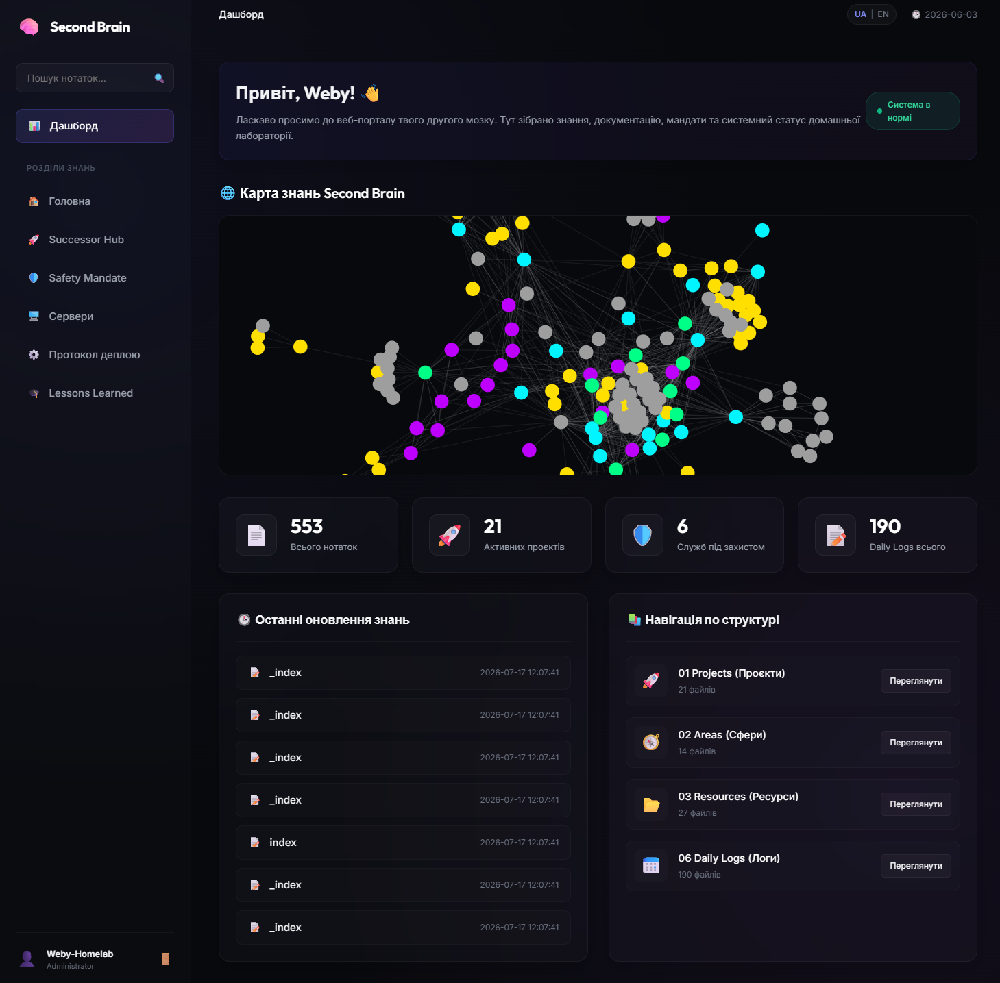

# 🧠 P.O.W.E.R-GUI

[🇺🇸 English](README.md) | [🇺🇦 Українська](README.ua.md)

[](https://hub.docker.com/r/webyhomelab/power-gui)
[](https://fastapi.tiangolo.com)
[](https://www.python.org)
[](https://github.com/weby-homelab/power-framework)
[](https://tailscale.com)
[](LICENSE)




**P.O.W.E.R-GUI** — це виробничий, AI-native веб-кокпіт та центр прийняття рішень для вашої персональної бази знань [Obsidian](https://obsidian.md) (Second Brain). Додаток розроблено виключно за стандартом **Docker-First**, він поєднує оператора-людину та автономних ШІ-агентів через екосистему **P.O.W.E.R Framework (P.A.R.A. + OKF v0.1 + Graph RAG + LLM-Wiki)**.

---

## 🏛️ Архітектура та Головні Принципи

P.O.W.E.R-GUI реалізує архітектурний патерн **Backend-For-Frontend (BFF)** на базі FastAPI та Pydantic v2 Settings. Додаток взаємодіє з базою знань виключно через канонічний інтерфейс `PowerClient` та `ApplicationService`, що гарантує повну відсутність невалідованих прямих перезаписів файлів на диску.

```
┌────────────────────────────────────────────────────────────────────────┐
│                              ОПЕРАТОР                                  │
│         (Граф знань / Гібридний пошук / Черга завдань та рішень)       │
└───────────────────────────────────┬────────────────────────────────────┘
                                    │ HTTP / SSE (Tailscale захист)
                                    ▼
┌────────────────────────────────────────────────────────────────────────┐
│                        P.O.W.E.R-GUI (Docker)                          │
│     [Дашборд]  [Редактор нотаток]  [Task Manager v2]  [Черга рішень]   │
│     [Bleach Санітизатор]  [CSRF Захист]  [Суворий CSP]  [WCAG 2.2 AA]  │
└───────────────────────────────────┬────────────────────────────────────┘
                                    │ PowerClient Port
                                    ▼
┌────────────────────────────────────────────────────────────────────────┐
│                     P.O.W.E.R Application API v2                       │
│        • Proposal Gate      • OKF Linter            • Event Ledger     │
│        • Task Store (flock) • Source Service        • Receipts Engine  │
└───────────────────────────────────┬────────────────────────────────────┘
                                    │ Direct / Inode I/O
                                    ▼
┌────────────────────────────────────────────────────────────────────────┐
│                        /brain (Obsidian Vault)                         │
└────────────────────────────────────────────────────────────────────────┘
```

---

## ✨ Ключові Можливості

### 1. 📋 Канонічний Task Manager v2 Cockpit
- **Інтерактивна Канбан-дошка:** Візуальне відстеження завдань по станах: `backlog` ➔ `ready` ➔ `in-progress` ➔ `blocked` / `input-required` / `auth-required` ➔ `completed` / `failed`.
- **Монотонний контроль ревізій:** Захист від втрати паралельних оновлень за допомогою перевірки `expected_revision`.
- **Append-Only журнал подій:** Кожна зміна стану формує незмінну подію з хешем корисного навантаження (SHA-256).
- **Живий стрімінг у реальному часі:** Миттєва доставка подій у браузер через Server-Sent Events (`/tasks/api/events/stream`).

### 2. 🛡️ Транзакційний Редактор Нотаток та Proposal Gate
- **Human-in-the-Loop потік:** ШІ-агенти та користувачі вносять зміни через пропозиції (`Edit` ➔ `Propose` ➔ `OKF Linter Validation` ➔ `Human Approval` ➔ `Apply`).
- **Захист від випадкового затирання:** Будь-яка зміна перевіряється через diff-перегляд і фіксується аудиторським чеком (Receipt).
- **Контроль колізій (ETag):** Запобігання конфліктам одночасного редагування кількома користувачами чи процесами.

### 3. 🌐 Динамічний 2D Граф Знань (Force-Directed)
- Візуалізація зв'язків між нотатками за допомогою D3 force-directed алгоритму.
- Підтримка глобального перегляду бази та локальних 2-рівневих піддерев для окремих документів.
- **Доступність WCAG 2.2 AA:** Таблична альтернатива з високим контрастом для екранних читачів та клавіатурної навігації.

### 4. 🔍 Мультимодальний Гібридний Пошук
- Миттєве перемикання між 4 режимами пошуку:
  - `Auto`: Гібридний щільний семантичний пошук із повнотекстовим fallback.
  - `FTS`: Швидкий повнотекстовий BM25-пошук.
  - `Semantic`: Семантичні ембеддінги (наприклад, `BGE-M3` 1024d).
  - `Reranked`: Переранжування через cross-encoder для складних запитів.

### 5. 🔒 Комплексна Безпека та Захист від Атак
- **Санітизація Bleach:** Повна нейтралізація XSS-векторів, небезпечних скриптів та шкідливих HTML-тегів.
- **CSRF-захист на HMAC-SHA256:** Обов'язкова перевірка токенів на всіх мутаційних POST-запитах.
- **Суворий заголовок CSP (Content Security Policy):** Повна автономність без завантаження сторонніх бібліотек із зовнішніх CDN.
- **Захист від Path Traversal:** Блокування виходу за межі ваулту через `PermissionError`.

---

## 🐳 Розгортання в Docker (Основний Стандарт)

P.O.W.E.R-GUI завжди та всюди розгортається у вигляді Docker-контейнера.

### 1. Швидкий запуск однією командою

```bash
docker run -d \
  --name power-gui \
  --restart unless-stopped \
  -p 8008:8080 \
  -v /шлях/до/вашого/obsidian/brain:/brain:rw \
  webyhomelab/power-gui:latest
```

Відкрийте у браузері: `http://<ip-вашого-сервера>:8008`.

---

### 2. Розгортання через Docker Compose

Створіть файл `docker-compose.yml`:

```yaml
version: '3.8'

services:
  power-gui:
    image: webyhomelab/power-gui:latest
    container_name: power-gui
    restart: unless-stopped
    ports:
      - "8008:8080"
    environment:
      - POWER_GUI_HOST=0.0.0.0
      - POWER_GUI_PORT=8080
      - POWER_GUI_VAULT_PATH=/brain
      - POWER_GUI_AUTH_ENABLED=false
    volumes:
      - /шлях/до/вашого/obsidian/brain:/brain:rw
```

Запустіть сервіс:

```bash
docker compose up -d
```

---

### 3. Розгортання в Proxmox VE (LXC Контейнер `LXC 200`)

Для запуску всередині непрівілейованого контейнера Proxmox:

1. **Прокинути директорію з нотатками з хоста Proxmox у LXC:**
   ```bash
   pct set 200 -mp0 /root/geminicli/brain,mp=/mnt/brain
   ```

2. **Запустити контейнер всередині LXC з томом `/mnt/brain`:**
   ```bash
   docker run -d \
     --name power-gui \
     --restart unless-stopped \
     -p 8008:8080 \
     -v /mnt/brain:/brain:rw \
     webyhomelab/power-gui:latest
   ```

---

## ⚙️ Довідник Змінних Середовища

Конфігурація здійснюється через змінні оточення з префіксом `POWER_GUI_`:

| Змінна | Тип | За замовчуванням | Опис |
| :--- | :---: | :---: | :--- |
| `POWER_GUI_HOST` | `str` | `0.0.0.0` | IP-адреса для прив'язки Uvicorn. |
| `POWER_GUI_PORT` | `int` | `8080` | Внутрішній порт сервера. |
| `POWER_GUI_VAULT_PATH` | `Path` | `/brain` | Абсолютний шлях до змонтованого ваулту Obsidian. |
| `POWER_GUI_AUTH_ENABLED` | `bool` | `false` | Увімкнення автентифікації через сесійні кукі. |
| `POWER_GUI_ADMIN_PASSWORD_HASH` | `str` | `""` | Хеш пароля адміністратора (SHA256 / PBKDF2). |
| `POWER_GUI_SECRET_KEY` | `str` | `"power-secret-key-12345"` | Секретний ключ для підпису сесій та CSRF-токенів. |
| `POWER_GUI_SESSION_MAX_AGE_SECONDS`| `int` | `86400` | Тривалість сесії в секундах (24 години). |
| `POWER_GUI_COOKIE_SECURE` | `bool` | `false` | `true` при роботі виключно через HTTPS. |
| `POWER_GUI_COOKIE_SAMESITE` | `str` | `lax` | Політика SameSite для кукі (`lax`, `strict`, `none`). |

---

## 🧪 Тестування та Верифікація

Запуск тестів та лінтерів:

```bash
# Запуск контрактних та юніт-тестів
pytest tests/ -v

# Перевірка стилю та безпеки коду
ruff check src tests
```

---

## 📄 Ліцензія

Розповсюджується під ліцензією **MIT License**. Див. [LICENSE](LICENSE) для деталей.
