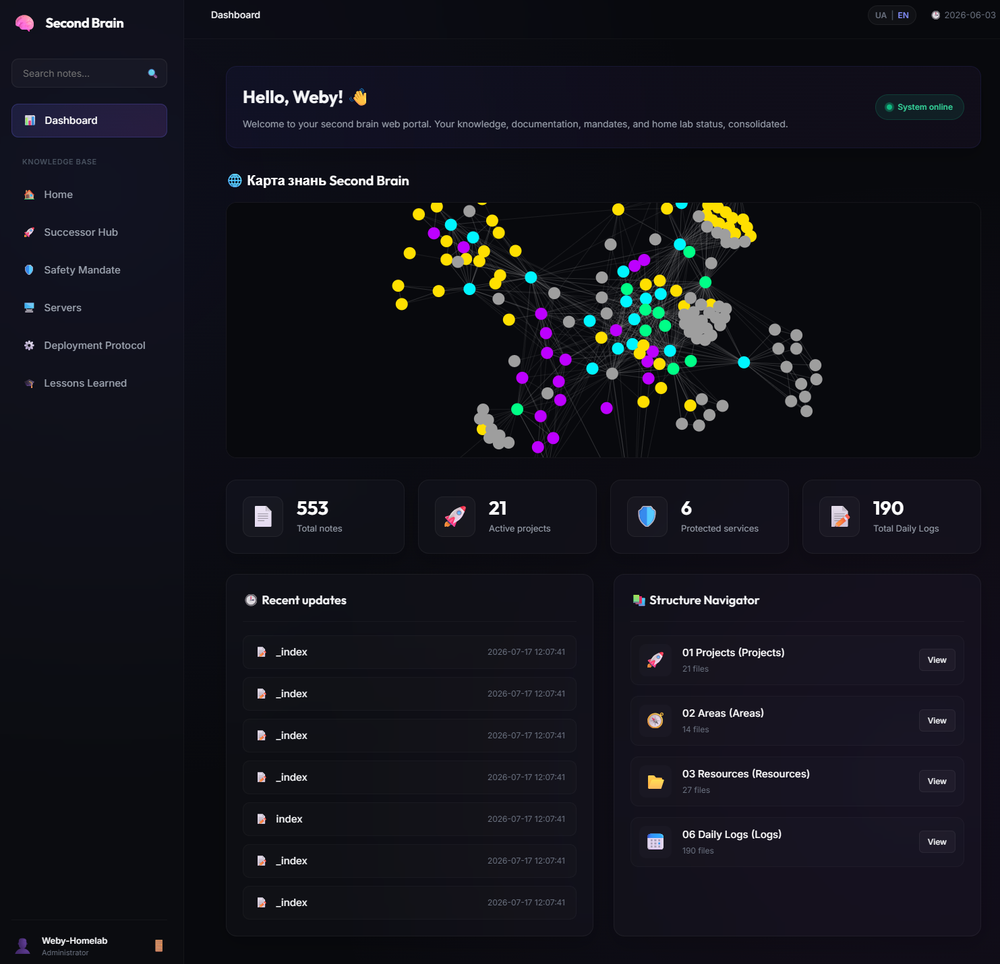

# 🧠 Second Brain Web Portal

[🇺🇸 English](README_ENG.md) | [🇺🇦 Українська](README.md)

[](https://fastapi.tiangolo.com)
[](https://www.python.org)
[](https://tailscale.com)
[](LICENSE)




A modern, highly secure, and aesthetically refined web interface to access, search, and monitor your personal Obsidian knowledge base (Second Brain). Powered by FastAPI, featuring a sleek Glassmorphism design and native Tailscale tunnel integration.

---

## ✨ Features

- 🚀 **Speed & Asynchrony:** Powered by FastAPI and Uvicorn for lightweight, instant page loading.
- 🎨 **Obsidian Compatibility:**
  - Renders flat Wiki-links (`[[Note Name]]`) with automatic resolution and link path mapping.
  - Native parsing for Obsidian **Callouts** (`> [!NOTE]`, `> [!TIP]`, `> [!WARNING]`, etc.).
  - Dynamic asset streaming to render vault media (images, graphics) securely.
- 🌐 **Interactive Graph View:** Visualizes note relations with a dynamic 2D knowledge graph powered by `Force-Graph` (D3 force-directed layout). Displays a global graph on the dashboard and a local 2-depth graph on note pages, allowing click-to-navigate.
- 🔍 **Global Search:** Search through notes by both filename and contents in real time with context snippet highlighting.
- 📊 **Interactive Dashboard:** Live stats including total notes count, directory-based breakdowns (e.g. Projects, Areas, Resources, Daily Logs), and a feed of recently updated documents.
- 💅 **Premium Glassmorphism UI:**
  - Elegant dark OLED theme (`#08090d`) with neon mesh-glow overlay backgrounds.
  - Border highlights, backdrop-filter blur effects, and Google Fonts typography (Outfit for headings, Inter for body).
  - 100% mobile-friendly responsive layout with touch-optimized margins and safe horizontal table scrolling.

---

## 🔌 Recommended Extension: P.O.W.E.R. Framework

To fully unlock the potential of your Obsidian Second Brain using AI agents (Claude, Cursor, OpenCode) and automate its maintenance, we highly recommend integrating the **[P.O.W.E.R. Framework](https://github.com/weby-homelab/power-framework)** — an AI-Native Toolkit for Obsidian:
- **🔍 Advanced Hybrid Search (BM25 + Dense Vectors):** Supports 4 search modes using models like `BGE-M3` or `Qwen3-Embedding`, with LLM query expansion and synonym processing.
- **🤖 MCP Server (Model Context Protocol):** Exposes 12 autonomous tools for AI agents, allowing them to index your vault, retrieve documents, identify logical contradictions, and auto-ingest sessions (`synthesize_session`).
- **🛡️ OKF Metadata Verification:** Enforces strict frontmatter schemas powered by Pydantic v2 (governance fields: `owner`, `status`, `expiry`) with auto-healing capabilities via `power heal`.
- **🔄 Freshness Monitoring & ROT Audit:** Automatically flags expired, redundant, outdated, and trivial notes, streamlining cleanup and archiving to `04_Archive/`.

---

## 🔒 Security & Isolation

- 🛡️ **LFI (Local File Inclusion) Protection:** All requested document paths are strictly verified by a `validate_path` wrapper using `os.path.commonpath`. Any Path Traversal attempt (e.g., `../../etc/passwd`) is immediately dropped returning a `403 Forbidden` error.
- ⚓ **Host Isolation:** The web server binds strictly to the loopback interface `127.0.0.1:8008`, ensuring it is invisible to external internet port scanners.
- 🔑 **HttpOnly Cookie Sessions:** Client-side authentication is handled via a randomized `session_token` cookie configured with `HttpOnly` and `SameSite=Strict` flags. Passwords are securely parsed from local system environment variables (`.env`).

---

## 🛠️ Installation & Setup

### 1. Clone the repository

```bash
git clone https://github.com/weby-homelab/ai-second-brain-gui.git
cd ai-second-brain-gui
```

### 2. Prepare Python virtual environment

```bash
python3 -m venv venv
source venv/bin/activate
pip install -r requirements.txt
```

### 3. Setup configuration `.env`

Create a `.env` file in the root directory (or direct the path to your existing configs):

```env
BRAIN_PORTAL_PASSWORD="your-strong-password"
```

---

## 🚀 Deployment

### Systemd Service Setup

Create a service config `/etc/systemd/system/ai-second-brain-gui.service`:

```ini
[Unit]
Description=Second Brain Portal Web Service
After=network.target

[Service]
User=root
WorkingDirectory=/root/geminicli/projects/ai-second-brain-gui
ExecStart=/root/geminicli/projects/ai-second-brain-gui/venv/bin/uvicorn main:app --host 127.0.0.1 --port 8008 --reload
Restart=always

[Install]
WantedBy=multi-user.target
```

Reload daemon and enable the service:

```bash
systemctl daemon-reload
systemctl enable ai-second-brain-gui --now
```

### Exposing Securely with Tailscale

To access your portal securely from any device in your Tailnet, run:

```bash
tailscale serve --bg 8008
```

This sets up an HTTPS reverse proxy at `https://<your-node>.<tailnet-name>.ts.net/` with automated TLS certificate management.

---

## 🤝 Contributing

Contributions to improve styling, parsing rules, or support for additional Obsidian syntax extensions are welcome. Feel free to open an Issue or a Pull Request!

---

## 📄 License

This project is distributed under the [MIT](LICENSE) license.
